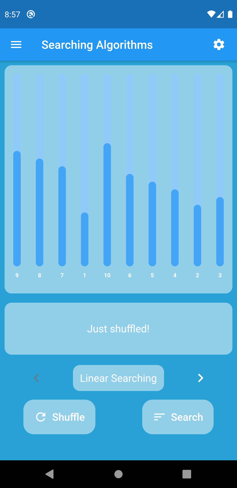
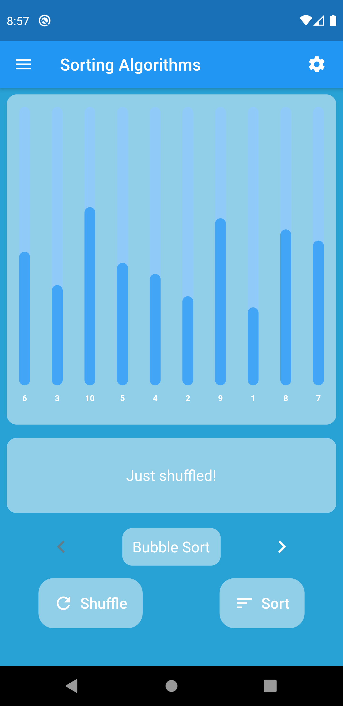
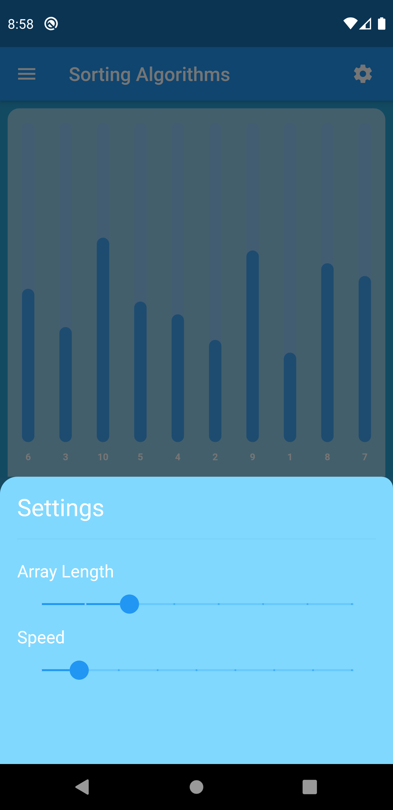
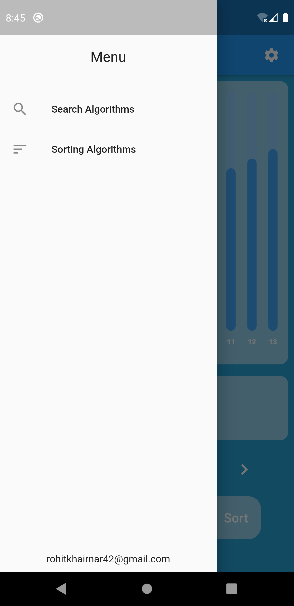

# AlgoV

A searching and sorting algorithm visualizer made using Flutter.

## Build With

* [fl_chart](https://pub.dev/packages/fl_chart) - 💥 A library to draw fantastic charts in Flutter 💥
* [google_fonts](https://pub.dev/packages/google_fonts) - The *google_fonts* package for Flutter allows you to easily use any of the 977 fonts (and their variants) from [fonts.google.com](https://fonts.google.com/) in your Flutter app.

## Visuals

## Contributing

Pull requests are welcome. For major changes, please open an issue first to discuss what you would like to change.
